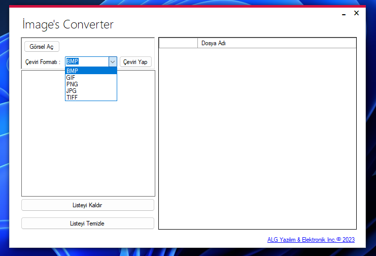

# ImagesConverter
This Program I Written With VB.net Helps You Convert Your Pictures To Various Formats.

# Debug and Start
Unzip the downloaded ImagesConverter-main.zip file
Open ImgConvert.sln with Visual Studio 2017 and Higher
NetFramework 4.8 Required MetroModernUI.1.4.0.0 Nuget Package Required.

# Screenshot
 
